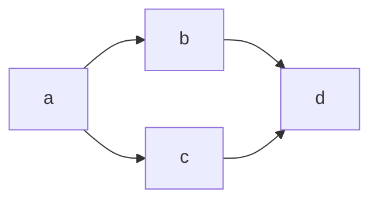

# Accessibility

Making the charts fully accessible is still a work in progress (feel free to add your contributions!)

## Title and Description

Each chart supports a `title` and `accDescription` that will add a `<title>` and `<description>` element to the rendered SVG. Adding these will help screen reader users know what the chart or graph is about.

### Examples
Some good examples of a `title` and `description`:

  <!-- title Flow chart
  accDescription Shows the flow of making a decision about what to eat for dinner -->
